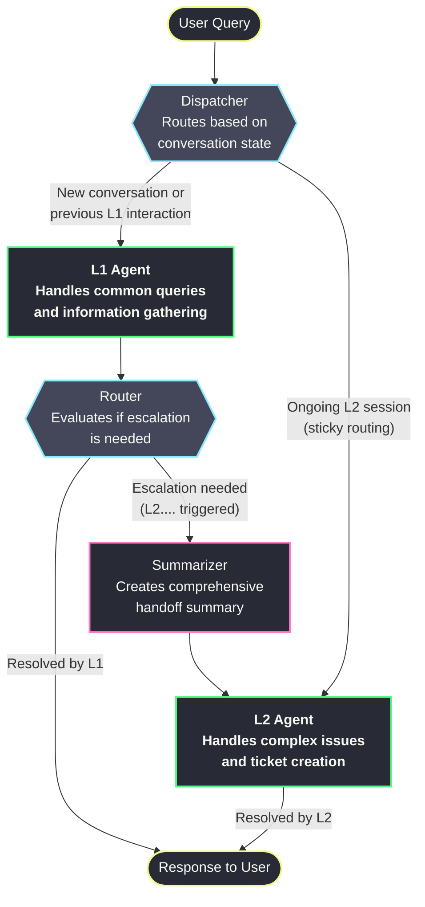

# Insurance Helpdesk - Internal Platform

A full-stack, AI-powered internal helpdesk application designed for insurance companies. This platform combines a modern React frontend with a sophisticated Python backend, featuring a multi-level conversational AI to provide comprehensive, contextual, and efficient user support.

## Key Features

- **Dual-Agent Architecture**: A tiered system with L1 and L2 agents, orchestrated by LangGraph, to handle queries of varying complexity.
- **Stateful Conversations**: LangGraph's SQLite checkpointing enables persistent, multi-turn conversations, allowing agents to remember context.
- **RAG-Powered Search**: A powerful Retrieval-Augmented Generation (RAG) pipeline using ChromaDB provides agents with instant access to a knowledge base of FAQ articles.
- **Automated Ticketing**: Seamless integration with the JIRA API allows the L2 agent to create, search, and manage support tickets automatically.
- **Email Notifications**: The system can send automated email updates and notifications to users via the Gmail API.
- **Performance Observability**: Integrated with LangSmith for real-time monitoring, tracing, and debugging of agent performance.
- **Modern UI**: A responsive and intuitive user interface built with React, Vite, and Tailwind CSS.

---

## System Architecture

### Agent Workflow Visualization

The core of the backend is a stateful graph that manages the flow of conversation between different components. This ensures a logical and efficient handling of user requests.



---

## Technology Stack

| Category              | Technology / Library                                                              |
| --------------------- | --------------------------------------------------------------------------------- |
| **Frontend**          | React 18, Vite, Tailwind CSS, Axios, React Router                                 |
| **Backend Framework** | Flask, Gunicorn (for production)                                                  |
| **AI Orchestration**  | LangChain, LangGraph                                                              |
| **LLM Providers**     | Google Gemini (L1 Agent), Groq Llama3-70B (L2 Agent)                              |
| **Database**          | PostgreSQL (for application data), SQLite (for conversation state)                |
| **Vector Store (RAG)**| ChromaDB with Sentence-Transformers                                               |
| **External Services** | JIRA API, Gmail API                                                               |
| **Observability**     | LangSmith                                                                         |
| **Dependencies**      | `psycopg2`, `jira`, `google-api-python-client`, `python-dotenv`                   |

---

## Getting Started

### Prerequisites

- Node.js (v18 or higher)
- Python (3.9 or higher)
- PostgreSQL Server (v12 or higher)
- API keys for Google, Groq, and JIRA.

### Installation & Setup

> **Note**
> The following steps guide you through a complete local setup of both the frontend and backend services.

#### 1. Clone the Repository
```bash
git clone <repository-url>
cd Insurance-Helpdesk_new
```

#### 2. Backend Setup
```bash
cd backend

# Create and activate virtual environment
python -m venv venv
# Windows:
.\venv\Scripts\activate
# macOS/Linux:
# source venv/bin/activate

# Install dependencies
pip install -r requirements.txt

# Create .env file and add your credentials
# (Refer to the detailed backend README for all required variables)
cp .env.example .env
```

#### 3. Frontend Setup
```bash
cd ../frontend

# Install dependencies
npm install

# Create .env file and specify the backend API URL
echo "VITE_API_URL=http://127.0.0.1:8001" > .env
```

### Running the Application

You will need two separate terminals to run both the backend and frontend servers.

- **Terminal 1: Start the Backend**
  ```bash
  cd backend
  # Make sure your virtual environment is activated
  python app.py
  ```

- **Terminal 2: Start the Frontend**
  ```bash
  cd frontend
  npm run dev
  ```
The application will be accessible at `http://localhost:5173`.

---

## Project Structure

The project is organized into a `frontend` and `backend` monorepo structure.

```
Insurance-Helpdesk_new/
│
├── frontend/
│   ├── src/
│   │   ├── components/
│   │   ├── pages/
│   │   └── App.jsx
│   ├── vite.config.js
│   └── package.json
│
└── backend/
    ├── app.py              # Main Flask application & API endpoints
    ├── ai/                 # AI agents, tools, and graph logic
    ├── database/           # Database models and connection management
    ├── services/           # Integrations with external services (JIRA, Gmail)
    ├── utils/              # Helper functions
    ├── config.py           # Application configuration
    └── requirements.txt    # Python dependencies
```

> For a more detailed breakdown, please see the [backend README](./backend/README.md).

---

## Development & Monitoring

### LangGraph Studio

For interactive development and visualization of the agent graph, you can use LangGraph Studio.

1.  **Install the CLI:**
    ```bash
    pip install "langgraph-cli[inmem]"
    ```
2.  **Run the Development Server:**
    ```bash
    # From the backend directory
    langgraph dev --config ai/Langgraph_module/langgraph.json
    ```

### LangSmith Observability

If you have set up LangSmith credentials in your `.env` file, you can monitor traces, performance, and debug issues at [smith.langchain.com](https://smith.langchain.com).

---

## Contributing

We welcome contributions! Please follow these steps:
1.  Fork the repository.
2.  Create a new feature branch (`git checkout -b feature/YourAmazingFeature`).
3.  Commit your changes (`git commit -m 'Add some AmazingFeature'`).
4.  Push to the branch (`git push origin feature/YourAmazingFeature`).
5.  Open a Pull Request.

## License

This project is proprietary software. All rights reserved.

---
Built by the Cywarden Team. 