# Insurance Helpdesk Backend 🏥

A sophisticated conversational AI backend system designed to provide multi-tiered insurance support through intelligent agent orchestration.

## 🌟 Overview

The Insurance Helpdesk Backend is a Flask-based conversational AI system that leverages LangGraph for stateful agent orchestration. It implements a tiered support model with L1 (primary) and L2 (escalation) agents, providing contextual, personalized assistance for insurance-related queries.

### Key Features

- **🤖 Dual-Agent Architecture**: Intelligent routing between L1 and L2 agents based on query complexity
- **🛡️ API-Driven Human-in-the-Loop (HITL)**: For sensitive actions like `update_user_data`, the system pauses execution using LangGraph's checkpointing and awaits approval from an administrator via a secure API.
- **💾 Stateful Conversations**: Persistent conversation state using LangGraph checkpointing
- **🔍 RAG-Powered FAQ Search**: Semantic search through insurance documentation using ChromaDB
- **🎫 JIRA Integration**: Automated ticket creation and management for complex issues
- **📧 Email Automation**: Gmail API integration for sending confirmations and updates
- **📊 Observability**: LangSmith integration for monitoring agent performance and metrics
- **🌐 Multi-language Support**: Agents can respond in the user's preferred language

## 🏗️ System Architecture

### Agent Workflow Visualization

```mermaid
graph TD
    Start(["🚀 User Query"]) --> Dispatcher{{"🔀 Dispatcher<br/>Routes based on<br/>conversation state"}}
    
    Dispatcher -->|"New conversation or<br/>previous L1 interaction"| L1["🤖 L1 Agent<br/>Handles common queries<br/>and information gathering"]
    
    Dispatcher -->|"Ongoing L2 session<br/>(sticky routing)"| L2["🧠 L2 Agent<br/>Handles complex issues<br/>and ticket creation"]
    
    L1 --> Router{{"🚦 Router<br/>Evaluates if escalation<br/>is needed"}}
    
    Router -->|"Resolved by L1"| End(["✅ Response to User"])
    Router -->|"Escalation needed<br/>(L2.... triggered)"| Summarizer["📝 Summarizer<br/>Creates comprehensive<br/>handoff summary"]
    
    Summarizer --> L2
    L2 -->|"Resolved by L2"| End
    
    style Start fill:#e1f5e1,stroke:#388e3c
    style End fill:#e1f5e1,stroke:#388e3c
    style L1 fill:#e3f2fd,stroke:#1976d2
    style L2 fill:#fce4ec,stroke:#d81b60
    style Summarizer fill:#fff3e0,stroke:#f57c00
    style Dispatcher fill:#f3e5f5,stroke:#7b1fa2
    style Router fill:#f3e5f5,stroke:#7b1fa2
```



### Workflow Automation: n8n

In addition to the conversational agent flow, this backend utilizes **n8n** for proactive, event-driven workflow automation. This system runs separately and connects to our application's services to automate key business processes.

Our primary use case is a **Proactive Renewal Workflow** that automatically identifies expiring policies, notifies customers, and creates internal tasks for agents.

For a detailed explanation of the n8n setup and a breakdown of the automation workflows, please see the dedicated **[n8n README](../n8n/README.md)**.

### Workflow Explanation

1. **🚀 User Query**: Every interaction begins with a user's question or request
2. **🔀 Dispatcher**: Intelligently routes queries based on conversation history - maintaining session continuity
3. **🤖 L1 Agent**: First-line support using Gemini, handles FAQs and basic information retrieval
4. **🚦 Router**: Analyzes L1's response to determine if escalation is necessary
5. **📝 Summarizer**: When escalation occurs, creates a comprehensive summary of the entire conversation
6. **🧠 L2 Agent**: Advanced support using Llama3-70B, handles complex queries and has ticket creation privileges
7. **✅ Response**: Final answer delivered to the user with appropriate actions taken

## 🛠️ Technology Stack

### Core Technologies
- **Framework**: Flask with CORS support
- **State Management**: LangGraph with SQLite checkpointing
- **LLM Providers**: 
  - Google Gemini 2.0 Flash (L1 Agent)
  - Groq Llama3-70B (L2 Agent)
- **Vector Database**: ChromaDB with sentence-transformers
- **Relational Database**: PostgreSQL with connection pooling
- **External Services**: JIRA API, Gmail API

### Key Dependencies
```
flask                       # Web framework
langchain                   # LLM orchestration
langgraph                   # Stateful agent workflows
langchain_google_genai      # Google AI integration
langchain_groq              # Groq integration
chromadb                    # Vector database
psycopg2                    # PostgreSQL adapter
jira                        # JIRA integration
google-api-python-client    # Gmail integration
langsmith                   # Observability
sentence-transformers       # Embeddings
```

## 📋 Prerequisites

- Python 3.9+
- PostgreSQL 12+
- API Keys:
  - Google AI API key
  - Groq API key
  - JIRA credentials
  - Gmail API credentials
  - LangSmith API key (optional)

## 🚀 Setup Instructions

### 1. Clone and Navigate
```bash
git clone <repository-url>
cd Insurance-Helpdesk_new/backend
```

### 2. Virtual Environment
```bash
# Windows
python -m venv venv
.\venv\Scripts\activate

# macOS/Linux
python -m venv venv
source venv/bin/activate
```

### 3. Install Dependencies
```bash
pip install -r requirements.txt
```

### 4. Environment Configuration
Create a `.env` file in the backend directory:

```env
# Flask Configuration
FLASK_SECRET_KEY='your-secret-key-here'
DEBUG=True
HOST=0.0.0.0
PORT=8001

# Database Configuration
DB_NAME='insurance_helpdesk'
DB_USER='your_db_user'
DB_PASSWORD='your_db_password'
DB_HOST='localhost'
DB_PORT='5432'

# AI Services
GOOGLE_API_KEY='your-google-api-key'
GROQ_API_KEY='your-groq-api-key'

# JIRA Configuration
JIRA_SERVER='https://your-domain.atlassian.net'
JIRA_USERNAME='your-email@example.com'
JIRA_API_TOKEN='your-jira-api-token'
JIRA_PROJECT_KEY='YOUR_PROJECT'

# Email Configuration
SENDER_EMAIL='your-email@gmail.com'

# ChromaDB Configuration
FAQ_DB_PATH='./faq_database/'
FAQ_COLLECTION_NAME='insurance_faqs'

# LangSmith (Optional)
LANGCHAIN_TRACING_V2=true
LANGCHAIN_API_KEY='your-langsmith-api-key'
LANGCHAIN_PROJECT='insurance-helpdesk'
```

### 5. Database Setup

#### PostgreSQL Tables
```sql
-- Users table
CREATE TABLE users (
    user_id UUID PRIMARY KEY DEFAULT gen_random_uuid(),
    name VARCHAR(255) NOT NULL,
    email VARCHAR(255) UNIQUE NOT NULL,
    passwords VARCHAR(255),
    phone VARCHAR(50),
    address TEXT,
    location VARCHAR(255),
    history JSONB DEFAULT '[]'::jsonb
);

-- Policies table
CREATE TABLE policies (
    policy_id VARCHAR(255) PRIMARY KEY,
    user_id UUID REFERENCES users(user_id) ON DELETE CASCADE,
    policy_type VARCHAR(255),
    policy_status VARCHAR(100),
    issue_date DATE,
    expiry_date DATE,
    premium_amount NUMERIC(10, 2),
    coverage_amount NUMERIC(12, 2),
    markdown_format TEXT
);
```

### 6. Gmail API Setup
1. Download OAuth 2.0 credentials from Google Cloud Console
2. Save as `secret.json` in the backend directory
3. First run will prompt for authorization

### 7. FAQ Database Population
```bash
# Place your FAQ CSV in backend/faq_database/
python faq_database/update_faq_db.py
```

## 📡 API Endpoints

### Chat Endpoints
```
POST /api/chat
Body: {
    "query": "User's question",
    "user_id": "uuid",
    "language": "en"
}
Response: {
    "responses": ["Agent response"],
    "user_id": "uuid",
    "is_l2": boolean
}
```

### Authentication
```
POST /api/login
Body: {
    "email": "user@example.com",
    "password": "password"
}

POST /api/logout
```

### User Data
```
GET /api/chat/history/<user_id>
GET /api/user/policies/<user_id>
```

### Admin Endpoints
```
GET /api/admin/users
GET /api/tickets/all
GET /api/metrics
```

```

### Human-in-the-Loop (HITL) Endpoints
```
GET /api/pending-approvals
Response: [
    {
        "thread_id": "uuid",
        "pending_update": { ... }
    }
]

POST /api/approve-update/<thread_id>
Body: {
    "decision": "approved" | "declined"
}
Response: {
    "status": "success",
    "message": "Update processed"
}
```

## 🏃‍♂️ Running the Application

```bash
# Development mode
python app.py

# Production mode
gunicorn -w 4 -b 0.0.0.0:8001 app:app
```

The backend will be available at `http://localhost:8001`

## 📁 Project Structure

```
backend/
│
├── app.py                  # Main Flask application
├── config.py               # Configuration management
├── requirements.txt        # Python dependencies
├── checkpoints.sqlite      # LangGraph conversation state
│
├── database/
│   ├── db_utils.py         # Connection pool management
│   └── models.py           # Database operations
│
├── faq_database/
│   ├── chroma.sqlite3      # Vector embeddings
│   └── update_faq_db.py    # FAQ loader script
│
├── ai/
│   ├── L1_agent.py         # Primary agent logic
│   ├── L2_agent.py         # Escalation agent logic
│   ├── tools.py            # Agent tools factory
│   ├── unified_chain.py    # RAG implementation
│   │
│   ├── Langgraph_module/
│   │   ├── Langgraph.py    # Graph nodes definition
│   │   └── graph_compiler.py # Graph assembly
│   │
│   └── langsmith/
│       └── langsmith_cache.py # Metrics caching
│
├── utils/
│   └── helpers.py          # Utility functions
│
└── services/
    ├── jira_service.py     # JIRA integration
    ├── email_service.py    # Gmail integration
    └── ticket_service.py   # Ticket facade
```

## 🧪 Development Guide

### Adding New Tools
1. Define the tool function in `ai/tools.py`
2. Add tool name to appropriate agent's tool list
3. Update agent prompts if necessary

### Modifying Agent Behavior
- L1 Agent prompt: `ai/L1_agent.py`
- L2 Agent prompt: `ai/L2_agent.py`
- Graph flow: `ai/Langgraph_module/graph_compiler.py`

### Database Migrations
- Add new models in `database/models.py`
- Update schema documentation
- Create migration scripts as needed

## 🔍 Monitoring & Debugging

### LangSmith Integration
- View traces at [smith.langchain.com](https://smith.langchain.com)
- Metrics cached locally in `ai/langsmith/metrics_cache.sqlite`
- Access metrics via `/api/metrics` endpoint

### Logging
- Flask logs to console by default
- Agent execution logs visible with `verbose=True`
- Database queries logged with connection pool

---

## 🛡️ Human-in-the-Loop (HITL) Architecture

To ensure security and oversight for sensitive operations, the backend implements an API-driven Human-in-the-Loop (HITL) system. This is triggered specifically when the L2 agent determines that user data needs to be modified via the `update_user_data` tool.

### HITL Workflow Visualization

```mermaid
graph TD
    subgraph "Main Agent Workflow"
        L2["L2 Agent"] -->|"Decides to use<br/>'update_user_data' tool"| L2Node["level2_node"]
        L2Node -->|"Tool call detected via<br/>'intermediate_steps'"| ApprovalNode["human_approval_node"]
        ApprovalNode -->|"`interrupt()` is called"| Checkpoint["💾 Graph State Persisted<br/>(Conversation Paused)"]
    end
    
    subgraph "External Admin Approval Workflow"
        Admin["Admin Operator"] -->|Runs `admin_console.py`| AdminConsole["Admin Console"]
        AdminConsole -->|"1. View pending tasks"| GetAPI["GET /api/pending-approvals"]
        GetAPI --> AdminConsole
        AdminConsole -->|"2. Approve/Decline task"| PostAPI["POST /api/approve-update/:thread_id"]
    end
    
    PostAPI -->|"Resumes graph execution"| ResumedNode["human_approval_node (Resumed)"]
    ResumedNode -->|If approved| UpdateDB["✅ Update User Data in DB"] --> NotifyUserSuccess["Notify User: Success"]
    ResumedNode -->|If declined| DeclineDB["❌ Log Decline Event"] --> NotifyUserDecline["Notify User: Declined"]

    %% Styling
    style L2 fill:#fce4ec,stroke:#d81b60
    style Admin fill:#e0e0e0, stroke:#333
    style Checkpoint fill:#fff3e0,stroke:#f57c00
    style GetAPI,PostAPI fill:#e3f2fd,stroke:#1976d2
```

### Workflow Explanation

1.  **Detection**: The `level2_node` inspects the `intermediate_steps` of the agent's execution. If it detects a call to the `update_user_data` tool, it adds a `pending_user_update` object to the graph's state.
2.  **Interruption**: The graph transitions to the `human_approval_node`, which immediately calls `interrupt()`. This pauses the graph, and the `SqliteSaver` checkpointer saves the entire conversation state (including the pending update) to the `checkpoints.sqlite` database.
3.  **Admin Notification (Pull Model)**: An administrator runs the separate `admin_console.py` client. This client makes a `GET` request to the `/api/pending-approvals` endpoint on the Flask server.
4.  **Approval API**: The Flask backend queries the checkpoints database for any interrupted threads and returns them to the admin console.
5.  **Decision**: The admin can choose to "approve" or "decline" a request. The console then sends a `POST` request to `/api/approve-update/<thread_id>` with the decision.
6.  **Resumption**: The backend API loads the graph state for the given thread, updates it with the decision, and resumes execution. The `human_approval_node` continues from where it left off, either calling the real `update_user_data` function or returning a "declined" message to the user.

This decoupled architecture ensures that the main application is non-blocking and that sensitive operations are handled securely and with human oversight.

---

## ⚙️ Core Mechanics Explained

### State Management: The `is_l2_session` Flag

A critical part of the agent's logic is determining whether to use the L1 or L2 agent for an incoming query. This is controlled by the `is_l2_session` boolean flag within the LangGraph state.

1.  **State Definition**: The `AgentState` class in `ai/Langgraph_module/Langgraph.py` defines the "clipboard" or state object for the graph. It includes the `is_l2_session: bool` field, which tracks the current support level.

2.  **State Persistence**: The application's graph is initialized with a `SqliteSaver` checkpointer. This automatically saves the entire `AgentState` object, including the `is_l2_session` flag, to the `checkpoints.sqlite` database after every turn. When a new query for an existing `user_id` comes in, the checkpointer loads the most recent state from this database.

3.  **Updating the Flag**:
    - When the **L1 agent** handles a query, its corresponding node (`l1_node`) always returns the state with `is_l2_session: False`.
    - When the L1 agent determines an escalation is needed (by returning "L2...."), the graph transitions to the `summarize_node` and then to the **L2 agent**.
    - The **L2 agent's** node (`l2_node`) sets the state to `is_l2_session: True`.

4.  **Routing Logic**: The `dispatcher` node, which is the entry point for every turn, reads this `is_l2_session` flag from the loaded state.
    - If `True`, it routes the query directly to the `l2_node`, creating a "sticky" L2 session.
    - If `False`, it routes to the `l1_node`.

This mechanism ensures that once a conversation is escalated to L2, it remains with the L2 agent for all subsequent turns for that user.

### Analytics: LangSmith Metrics Caching

To provide fast analytics on the frontend dashboard without constantly hitting the LangSmith API, the system uses a local caching mechanism.

1.  **Cache Database**: The `ai/langsmith/langsmith_cache.py` script initializes a local SQLite database at `ai/langsmith/metrics_cache.sqlite`. This database has a single table, `metrics_cache`, designed to store fetched data as key-value pairs (`cache_key`, `data`).

2.  **Fetching & Caching**: The core function, `fetch_and_cache_all_metrics`, connects to the LangSmith client, fetches raw run data for traces, LLM performance, and tool usage over the last 7 days.

3.  **Data Aggregation**: After fetching, the script processes this raw data. It aggregates metrics into 8-hour windows, calculating statistics like success/error counts, latency percentiles (p50, p95, p99), cost, and token usage.

4.  **Persistent Storage**: The aggregated, processed data is then stored as a JSON object in the `metrics_cache` table. The `cache_key` is a descriptive string (e.g., `"trace_metrics"`, `"llm_metrics"`), and the data is the JSON payload. This allows the `/api/metrics` endpoint to quickly retrieve pre-computed analytics directly from the local SQLite database, providing a fast and responsive dashboard experience.

## 🤝 Contributing

1. Fork the repository
2. Create a feature branch (`git checkout -b feature/AmazingFeature`)
3. Commit changes (`git commit -m 'Add AmazingFeature'`)
4. Push to branch (`git push origin feature/AmazingFeature`)
5. Open a Pull Request

## 📄 License

This project is proprietary software. All rights reserved.

## 🆘 Support

For issues and questions:
- Check existing issues on GitHub
- Contact the development team
- Review agent logs for debugging

---

Built with ❤️ by the Insurance Helpdesk Team