# Insurance Helpdesk Backend 🏥

A sophisticated conversational AI backend system designed to provide multi-tiered insurance support through intelligent agent orchestration.

## 🌟 Overview

The Insurance Helpdesk Backend is a Flask-based conversational AI system that leverages LangGraph for stateful agent orchestration. It implements a tiered support model with L1 (primary) and L2 (escalation) agents, providing contextual, personalized assistance for insurance-related queries.

### Key Features

- **🤖 Dual-Agent Architecture**: Intelligent routing between L1 and L2 agents based on query complexity
- **💾 Stateful Conversations**: Persistent conversation state using LangGraph checkpointing
- **🔍 RAG-Powered FAQ Search**: Semantic search through insurance documentation using ChromaDB
- **🎫 JIRA Integration**: Automated ticket creation and management for complex issues
- **📧 Email Automation**: Gmail API integration for sending confirmations and updates
- **📊 Observability**: LangSmith integration for monitoring agent performance and metrics
- **🌐 Multi-language Support**: Agents can respond in the user's preferred language

## 🏗️ System Architecture

### Agent Workflow Visualization

```mermaid
graph TD
    Start(["🚀 User Query"]) --> Dispatcher{{"🔀 Dispatcher<br/>Routes based on<br/>conversation state"}}
    
    Dispatcher -->|"New conversation or<br/>previous L1 interaction"| L1["🤖 L1 Agent<br/>Handles common queries<br/>and information gathering"]
    
    Dispatcher -->|"Ongoing L2 session<br/>(sticky routing)"| L2["🧠 L2 Agent<br/>Handles complex issues<br/>and ticket creation"]
    
    L1 --> Router{{"🚦 Router<br/>Evaluates if escalation<br/>is needed"}}
    
    Router -->|"Query resolved"| End1(["✅ Response to User"])
    Router -->|"Escalation needed<br/>(L2.... triggered)"| Summarizer["📝 Summarizer<br/>Creates comprehensive<br/>handoff summary"]
    
    Summarizer --> L2
    L2 --> End2(["✅ Response to User"])
    
    style Start fill:#e1f5e1
    style End1 fill:#e1f5e1
    style End2 fill:#e1f5e1
    style L1 fill:#e3f2fd
    style L2 fill:#fce4ec
    style Summarizer fill:#fff3e0
    style Dispatcher fill:#f3e5f5
    style Router fill:#f3e5f5
```



### Workflow Explanation

1. **🚀 User Query**: Every interaction begins with a user's question or request
2. **🔀 Dispatcher**: Intelligently routes queries based on conversation history - maintaining session continuity
3. **🤖 L1 Agent**: First-line support using Gemini, handles FAQs and basic information retrieval
4. **🚦 Router**: Analyzes L1's response to determine if escalation is necessary
5. **📝 Summarizer**: When escalation occurs, creates a comprehensive summary of the entire conversation
6. **🧠 L2 Agent**: Advanced support using Llama3-70B, handles complex queries and has ticket creation privileges
7. **✅ Response**: Final answer delivered to the user with appropriate actions taken

## 🛠️ Technology Stack

### Core Technologies
- **Framework**: Flask with CORS support
- **State Management**: LangGraph with SQLite checkpointing
- **LLM Providers**: 
  - Google Gemini 2.0 Flash (L1 Agent)
  - Groq Llama3-70B (L2 Agent)
- **Vector Database**: ChromaDB with sentence-transformers
- **Relational Database**: PostgreSQL with connection pooling
- **External Services**: JIRA API, Gmail API

### Key Dependencies
```
flask                       # Web framework
langchain                   # LLM orchestration
langgraph                   # Stateful agent workflows
langchain_google_genai      # Google AI integration
langchain_groq              # Groq integration
chromadb                    # Vector database
psycopg2                    # PostgreSQL adapter
jira                        # JIRA integration
google-api-python-client    # Gmail integration
langsmith                   # Observability
sentence-transformers       # Embeddings
```

## 📋 Prerequisites

- Python 3.9+
- PostgreSQL 12+
- API Keys:
  - Google AI API key
  - Groq API key
  - JIRA credentials
  - Gmail API credentials
  - LangSmith API key (optional)

## 🚀 Setup Instructions

### 1. Clone and Navigate
```bash
git clone <repository-url>
cd Insurance-Helpdesk_new/backend
```

### 2. Virtual Environment
```bash
# Windows
python -m venv venv
.\venv\Scripts\activate

# macOS/Linux
python -m venv venv
source venv/bin/activate
```

### 3. Install Dependencies
```bash
pip install -r requirements.txt
```

### 4. Environment Configuration
Create a `.env` file in the backend directory:

```env
# Flask Configuration
FLASK_SECRET_KEY='your-secret-key-here'
DEBUG=True
HOST=0.0.0.0
PORT=8001

# Database Configuration
DB_NAME='insurance_helpdesk'
DB_USER='your_db_user'
DB_PASSWORD='your_db_password'
DB_HOST='localhost'
DB_PORT='5432'

# AI Services
GOOGLE_API_KEY='your-google-api-key'
GROQ_API_KEY='your-groq-api-key'

# JIRA Configuration
JIRA_SERVER='https://your-domain.atlassian.net'
JIRA_USERNAME='your-email@example.com'
JIRA_API_TOKEN='your-jira-api-token'
JIRA_PROJECT_KEY='YOUR_PROJECT'

# Email Configuration
SENDER_EMAIL='your-email@gmail.com'

# ChromaDB Configuration
FAQ_DB_PATH='./faq_database/'
FAQ_COLLECTION_NAME='insurance_faqs'

# LangSmith (Optional)
LANGCHAIN_TRACING_V2=true
LANGCHAIN_API_KEY='your-langsmith-api-key'
LANGCHAIN_PROJECT='insurance-helpdesk'
```

### 5. Database Setup

#### PostgreSQL Tables
```sql
-- Users table
CREATE TABLE users (
    user_id UUID PRIMARY KEY DEFAULT gen_random_uuid(),
    name VARCHAR(255) NOT NULL,
    email VARCHAR(255) UNIQUE NOT NULL,
    passwords VARCHAR(255),
    phone VARCHAR(50),
    address TEXT,
    location VARCHAR(255),
    history JSONB DEFAULT '[]'::jsonb
);

-- Policies table
CREATE TABLE policies (
    policy_id VARCHAR(255) PRIMARY KEY,
    user_id UUID REFERENCES users(user_id) ON DELETE CASCADE,
    policy_type VARCHAR(255),
    policy_status VARCHAR(100),
    issue_date DATE,
    expiry_date DATE,
    premium_amount NUMERIC(10, 2),
    coverage_amount NUMERIC(12, 2),
    markdown_format TEXT
);
```

### 6. Gmail API Setup
1. Download OAuth 2.0 credentials from Google Cloud Console
2. Save as `secret.json` in the backend directory
3. First run will prompt for authorization

### 7. FAQ Database Population
```bash
# Place your FAQ CSV in backend/faq_database/
python faq_database/update_faq_db.py
```

## 📡 API Endpoints

### Chat Endpoints
```
POST /api/chat
Body: {
    "query": "User's question",
    "user_id": "uuid",
    "language": "en"
}
Response: {
    "responses": ["Agent response"],
    "user_id": "uuid",
    "is_l2": boolean
}
```

### Authentication
```
POST /api/login
Body: {
    "email": "user@example.com",
    "password": "password"
}

POST /api/logout
```

### User Data
```
GET /api/chat/history/<user_id>
GET /api/user/policies/<user_id>
```

### Admin Endpoints
```
GET /api/admin/users
GET /api/tickets/all
GET /api/metrics
```

## 🏃‍♂️ Running the Application

```bash
# Development mode
python app.py

# Production mode
gunicorn -w 4 -b 0.0.0.0:8001 app:app
```

The backend will be available at `http://localhost:8001`

## 📁 Project Structure

```
backend/
│
├── app.py                  # Main Flask application
├── config.py               # Configuration management
├── requirements.txt        # Python dependencies
├── checkpoints.sqlite      # LangGraph conversation state
│
├── database/
│   ├── db_utils.py         # Connection pool management
│   └── models.py           # Database operations
│
├── faq_database/
│   ├── chroma.sqlite3      # Vector embeddings
│   └── update_faq_db.py    # FAQ loader script
│
├── ai/
│   ├── L1_agent.py         # Primary agent logic
│   ├── L2_agent.py         # Escalation agent logic
│   ├── tools.py            # Agent tools factory
│   ├── unified_chain.py    # RAG implementation
│   │
│   ├── Langgraph_module/
│   │   ├── Langgraph.py    # Graph nodes definition
│   │   └── graph_compiler.py # Graph assembly
│   │
│   └── langsmith/
│       └── langsmith_cache.py # Metrics caching
│
├── utils/
│   └── helpers.py          # Utility functions
│
└── services/
    ├── jira_service.py     # JIRA integration
    ├── email_service.py    # Gmail integration
    └── ticket_service.py   # Ticket facade
```

## 🧪 Development Guide

### Adding New Tools
1. Define the tool function in `ai/tools.py`
2. Add tool name to appropriate agent's tool list
3. Update agent prompts if necessary

### Modifying Agent Behavior
- L1 Agent prompt: `ai/L1_agent.py`
- L2 Agent prompt: `ai/L2_agent.py`
- Graph flow: `ai/Langgraph_module/graph_compiler.py`

### Database Migrations
- Add new models in `database/models.py`
- Update schema documentation
- Create migration scripts as needed

## 🔍 Monitoring & Debugging

### LangSmith Integration
- View traces at [smith.langchain.com](https://smith.langchain.com)
- Metrics cached locally in `ai/langsmith/metrics_cache.sqlite`
- Access metrics via `/api/metrics` endpoint

### Logging
- Flask logs to console by default
- Agent execution logs visible with `verbose=True`
- Database queries logged with connection pool

### LangGraph Studio

For interactive development, visualization, and debugging of the agent graph, you can use LangGraph Studio. This provides a web-based IDE that connects to your local code.

1.  **Install the CLI:**
    If you haven't already, install the LangGraph command-line interface:
    ```bash
    pip install "langgraph-cli[inmem]"
    ```

2.  **Run the Development Server:**
    From the `backend` directory, run the following command to start the local development server:
    ```bash
    langgraph dev --config ai/Langgraph_module/langgraph.json
    ```

3.  **Access the Studio:**
    The command will output a URL for the Studio UI (e.g., `https://smith.langchain.com/studio/?baseUrl=...`). Open this URL in your browser to start interacting with your agent.

## 🤝 Contributing

1. Fork the repository
2. Create a feature branch (`git checkout -b feature/AmazingFeature`)
3. Commit changes (`git commit -m 'Add AmazingFeature'`)
4. Push to branch (`git push origin feature/AmazingFeature`)
5. Open a Pull Request

## 📄 License

This project is proprietary software. All rights reserved.

## 🆘 Support

For issues and questions:
- Check existing issues on GitHub
- Contact the development team
- Review agent logs for debugging

---

Built with ❤️ by the Insurance Helpdesk Team