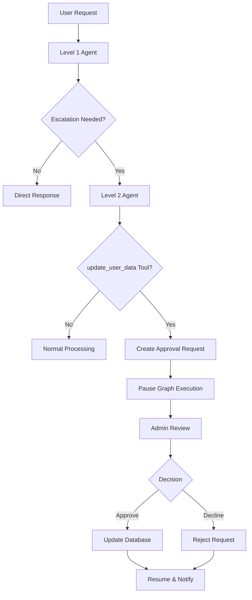

# Human-in-the-Loop (HITL) System Documentation

## 🎯 Overview

The Human-in-the-Loop (HITL) system provides administrative oversight for sensitive operations in the Insurance Helpdesk backend. When a Level 2 agent attempts to modify user data via the `update_user_data` tool, the system automatically pauses execution and awaits human administrator approval through a secure API-driven workflow.

## 🏗️ Architecture

### System Components

```
┌─────────────────┐    ┌──────────────────┐    ┌─────────────────┐
│   Frontend      │    │   Backend API    │    │   Admin Panel   │
│   (User Chat)   │◄──►│   (Flask App)    │◄──►│   (External)    │
└─────────────────┘    └──────────────────┘    └─────────────────┘
                              │
                              ▼
                       ┌──────────────────┐
                       │  LangGraph       │
                       │  State Machine   │
                       │  (checkpoints)   │
                       └──────────────────┘
                              │
                              ▼
                       ┌──────────────────┐
                       │  PostgreSQL      │
                       │  (User Data)     │
                       └──────────────────┘
```

### Core Workflow



## 🔧 Implementation Details

### State Management

The system uses LangGraph's `SqliteSaver` for persistent state management across interruptions:

```python
class AgentState(TypedDict):
    # Core conversation state
    query: str
    user_id: str
    language: str
    history: List[Dict[str, Any]]
    new_responses: List[str]
    is_level2_session: bool
    escalation_summary: str
    
    # HITL-specific state
    pending_approvals: List[Dict[str, Any]]    # Requests awaiting approval
    approved_approvals: List[Dict[str, Any]]   # Approved requests history
    declined_approvals: List[Dict[str, Any]]   # Declined requests history
    human_approval_status: Optional[str]       # Current approval decision
    human_approval_response: Optional[str]     # Admin response message
    routing_decision: str                      # Graph routing control
```

### Approval Request Structure

```python
approval_request = {
    "thread_id": "USR1205",           # User ID (used as thread ID)
    "user_id": "USR1205",             # User identifier
    "details": {                      # Requested changes
        "phone": "09876543433"
    },
    "timestamp": "uuid-string"        # Unique request identifier
}
```

### Priority Logic

The system implements intelligent priority logic for status determination:

```python
# Priority: declined > pending > approved > no_history
if declined_list:
    status = "declined"
elif pending_list:
    status = "pending"
elif approved_list:
    status = "approved"
else:
    status = "no_history"
```

This ensures that if a user has a declined request, it takes precedence over pending requests (handling duplicate requests).

## 🔌 API Endpoints

### HITL Management Endpoints

#### `GET /api/pending-approvals`
Fetches all approval requests across all users, categorized by status.

**Response:**
```json
{
    "pending": [
        {
            "thread_id": "USR1205",
            "user_id": "USR1205",
            "details": {"phone": "09876543433"},
            "timestamp": "uuid-string"
        }
    ],
    "approved": [],
    "declined": []
}
```

#### `GET /api/pending-approvals/{user_id}`
Fetches approval status for a specific user.

**Response:**
```json
{
    "status": "pending"  // "pending", "approved", "declined", or "no_history"
}
```

#### `POST /api/approve-update/{thread_id}`
Processes admin decision for a pending approval request.

**Request:**
```json
{
    "decision": "approved"  // or "declined"
}
```

**Response:**
```json
{
    "status": "success",
    "message": "Decision 'approved' processed for thread USR1205."
}
```

## 🧪 Testing Guide

### 1. Create a User Update Request

```bash
curl -X POST http://localhost:8001/api/chat \
  -H "Content-Type: application/json" \
  -d '{
    "query": "I want to change my phone number to 1234567890",
    "user_id": "USR1205",
    "language": "en"
  }'
```

**Expected Response:**
```json
{
    "responses": ["Your update request has been submitted for approval."],
    "user_id": "USR1205",
    "is_l2": true
}
```

### 2. Check Pending Approvals

```bash
curl http://localhost:8001/api/pending-approvals
```

**Expected Response:**
```json
{
    "pending": [
        {
            "thread_id": "USR1205",
            "user_id": "USR1205",
            "details": {"phone": "1234567890"},
            "timestamp": "uuid-string"
        }
    ],
    "approved": [],
    "declined": []
}
```

### 3. Check User-Specific Status

```bash
curl http://localhost:8001/api/pending-approvals/USR1205
```

**Expected Response:**
```json
{
    "status": "pending"
}
```

### 4. Process Admin Decision

```bash
# Approve the request
curl -X POST http://localhost:8001/api/approve-update/USR1205 \
  -H "Content-Type: application/json" \
  -d '{"decision": "approved"}'

# Or decline the request
curl -X POST http://localhost:8001/api/approve-update/USR1205 \
  -H "Content-Type: application/json" \
  -d '{"decision": "declined"}'
```

**Expected Response:**
```json
{
    "status": "success",
    "message": "Decision 'approved' processed for thread USR1205."
}
```

### 5. Verify Status Update

```bash
curl http://localhost:8001/api/pending-approvals/USR1205
```

**Expected Response (after approval):**
```json
{
    "status": "approved"
}
```

**Expected Response (after decline):**
```json
{
    "status": "declined"
}
```

## 🔍 Debugging

### Debug Logging

The system provides extensive debug logging. Key debug points to watch for:

- **HITL Detection:** `---UPDATE_USER_DATA TOOL DETECTED - STORING FOR HUMAN APPROVAL---`
- **Admin Decision:** `---APPROVE-UPDATE ENDPOINT TRIGGERED FOR THREAD: {thread_id}---`
- **State Updates:** `---[BEFORE/AFTER INVOKE] CURRENT STATE for thread {thread_id}---`
- **User Status:** `---DEBUG USER STATUS for {user_id}---`

### Common Issues & Solutions

#### 1. Status Not Updating After Admin Decision

**Problem:** User status remains "pending" even after admin decision.

**Debug Steps:**
```bash
# Check current state
curl http://localhost:8001/api/pending-approvals/USR1205

# Look for debug output in backend console:
# ---DEBUG USER STATUS for USR1205---
# Pending list: [...]
# Approved list: [...]
# Declined list: [...]
# ---DETERMINED STATUS: ...---
```

**Solutions:**
- Check if there are multiple pending requests
- Verify the priority logic (declined > pending > approved)
- Ensure the graph is properly resuming

#### 2. Graph Not Pausing for Approval

**Problem:** System doesn't pause when `update_user_data` tool is called.

**Debug Steps:**
- Check backend logs for `---UPDATE_USER_DATA TOOL DETECTED---`
- Verify `interrupt_before=["human_approval"]` in graph compilation
- Ensure routing decision is set to "human_approval"

**Solutions:**
- Check `ai/Langgraph_module/graph_compiler.py` for interrupt configuration
- Verify `update_user_data` tool is being called correctly
- Check `level2_node` tool detection logic

#### 3. State Persistence Issues

**Problem:** State is lost between requests or admin decisions.

**Debug Steps:**
- Check `checkpoints.sqlite` file permissions
- Verify SQLite connection is working
- Ensure proper `thread_id` usage

**Solutions:**
- Check file permissions on `checkpoints.sqlite`
- Verify `SqliteSaver` configuration
- Ensure consistent `user_id` usage as `thread_id`

### State Inspection

To inspect the current state of a user:

```python
# In Python console
from ai.Langgraph_module.graph_compiler import app_graph

config = {"configurable": {"thread_id": "USR1205"}}
state = app_graph.get_state(config)
print(state.values)
```

## 🔒 Security Considerations

### HITL Security Features

- **All sensitive operations require admin approval**
- **Approval decisions are logged and persisted**
- **State is maintained across interruptions**
- **No sensitive data is exposed in API responses**

### API Security

- **CORS configured for frontend integration**
- **Input validation on all endpoints**
- **Error handling prevents information leakage**
- **Database connection pooling for performance**

### Best Practices

1. **Always verify admin credentials before processing decisions**
2. **Log all approval/decline actions for audit trails**
3. **Implement rate limiting on approval endpoints**
4. **Use HTTPS in production environments**
5. **Regularly backup `checkpoints.sqlite`**

## 📊 Monitoring & Observability

### Key Metrics to Monitor

- **Pending approval count**
- **Average approval time**
- **Approval/decline ratios**
- **Failed approval attempts**
- **State persistence errors**

### Log Analysis

```bash
# Monitor HITL-related logs
grep "HUMAN APPROVAL" backend.log
grep "UPDATE_USER_DATA TOOL DETECTED" backend.log
grep "APPROVE-UPDATE ENDPOINT" backend.log
```

### Health Checks

```bash
# Check if HITL endpoints are responding
curl -f http://localhost:8001/api/pending-approvals
curl -f http://localhost:8001/api/pending-approvals/USR1205
```

## 🚀 Production Deployment

### Configuration

```python
# Production HITL settings
HITL_ENABLED = True
HITL_TIMEOUT = 3600  # 1 hour timeout for approvals
HITL_MAX_RETRIES = 3
HITL_AUDIT_LOGGING = True
```

### Scaling Considerations

- **Multiple admin consoles can connect simultaneously**
- **State is thread-safe via SQLite**
- **Consider Redis for high-traffic scenarios**
- **Implement approval queues for high-volume operations**

### Backup Strategy

```bash
# Backup checkpoints database
cp checkpoints.sqlite checkpoints_backup_$(date +%Y%m%d_%H%M%S).sqlite

# Restore from backup
cp checkpoints_backup_20231201_143022.sqlite checkpoints.sqlite
```

## 🤝 Integration with Frontend

### Frontend Integration Points

1. **Real-time status updates** via polling `/api/pending-approvals/{user_id}`
2. **Admin panel integration** for approval management
3. **Toast notifications** for approval status changes
4. **Loading states** during approval processing

### Example Frontend Code

```javascript
// Check user approval status
const checkApprovalStatus = async (userId) => {
  const response = await fetch(`/api/pending-approvals/${userId}`);
  const data = await response.json();
  return data.status; // "pending", "approved", "declined", "no_history"
};

// Poll for status updates
const pollStatus = (userId, callback) => {
  const interval = setInterval(async () => {
    const status = await checkApprovalStatus(userId);
    if (status !== "pending") {
      clearInterval(interval);
      callback(status);
    }
  }, 5000); // Poll every 5 seconds
};
```

## 📝 Troubleshooting Checklist

- [ ] **HITL Detection:** Verify `update_user_data` tool is being called
- [ ] **Graph Pausing:** Check `interrupt_before` configuration
- [ ] **State Persistence:** Verify `checkpoints.sqlite` is writable
- [ ] **API Endpoints:** Test all HITL endpoints are responding
- [ ] **Priority Logic:** Confirm status determination is working
- [ ] **Admin Decisions:** Verify approval/decline processing
- [ ] **Frontend Integration:** Test status polling and updates
- [ ] **Error Handling:** Check error responses and logging
- [ ] **Security:** Verify admin authentication and authorization
- [ ] **Performance:** Monitor response times and resource usage

---

**Note:** This HITL system ensures that sensitive operations are properly reviewed while maintaining a smooth user experience through intelligent state management and API-driven workflows. 