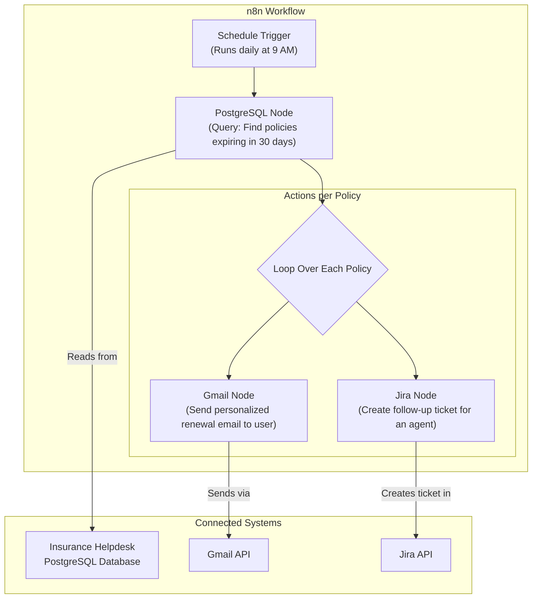

# 🤖 n8n Workflow Automation

This directory contains the configuration for our n8n (pronounced "en-eight-en") workflow automation engine, used for orchestrating automated, multi-step business processes that connect various services within the Insurance Helpdesk ecosystem.

## 🌟 Overview

n8n is a self-hosted, node-based automation platform. It allows us to build complex workflows visually, acting as the "glue" that connects our application's database with external services like Gmail and Jira, all without writing extensive custom code. This is a crucial component for moving beyond purely conversational AI and into proactive, event-driven automation.

## 🚀 Setup & Installation

The n8n environment is fully containerized and managed by Docker Compose for easy setup and consistency.

1.  **Navigate to the n8n directory:**
    ```bash
    cd backend/n8n
    ```

2.  **Start the services:**
    ```bash
    docker-compose up -d
    ```
    This command will start two Docker containers:
    - `n8n`: The main application service.
    - `db`: A dedicated PostgreSQL database for n8n to store its own workflows and credentials.

3.  **Access the n8n Web Interface:**
    - Open your browser and navigate to **[http://localhost:5678](http://localhost:5678)**.
    - Log in with the default credentials:
        - **Username**: `admin`
        - **Password**: `admin`

## 📄 Proof-of-Concept: Proactive Renewal Workflow

Our initial proof-of-concept is a scheduled workflow that automates the process of handling expiring insurance policies.

### Workflow Logic

1.  **Trigger (Daily Schedule)**: Every day at 9:00 AM, the workflow automatically starts.
2.  **Query Database**: It connects to the application's main PostgreSQL database and queries for all policies that are set to expire within the next 30 days. It joins the `policies` and `users` tables to retrieve all necessary details, including the user's name and email.
3.  **Loop & Process**: For each expiring policy found, the workflow executes the following two actions in parallel:
    - **Send Email**: It sends a personalized renewal reminder directly to the customer's email address via Gmail.
    - **Create Jira Ticket**: It creates a new task in Jira and assigns it to a human agent, providing them with all the context needed to follow up with the customer about renewal options.

### Workflow Visualization



### Credentials Management

All credentials required for this workflow (PostgreSQL, Gmail, and Jira) are stored securely within the n8n vault. To configure them, navigate to the **Credentials** tab in the n8n web interface. **Do not store credentials directly in the workflow or in the `docker-compose.yml` file.**
